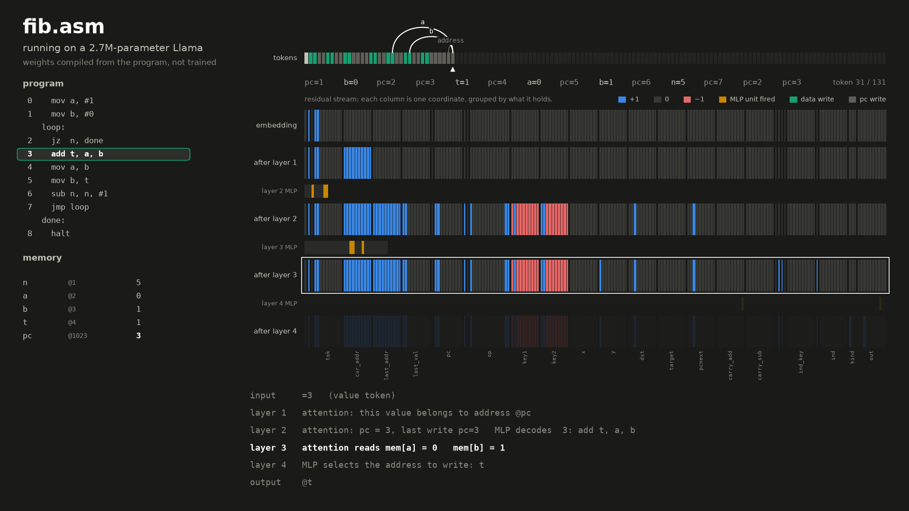

# llm-compute

A compiler from a tiny assembly language to the **exact weights of a standard
Llama transformer**. No training. The output is an ordinary HuggingFace
checkpoint (`config.json` + `model.safetensors` + `tokenizer.json`) that you run
with `transformers` like any other model. Greedy decoding *is* program execution.

The point: a transformer is a general-purpose computer. Memory is the token
stream, one `(address, value)` write per token pair, most recent write wins.
The program is in the weights. The input prompt is the initial memory.

```
$ uv run python -m llmc compile examples/fib.asm out/fib
9 instructions -> out/fib: 4 layers, d=201, 3 heads, mlp=512, vocab=2050, 2.68M params

$ uv run python -m llmc run out/fib --mem n=10
105 writes (210 tokens) in 0.1s
final memory: {'n': 0, 'a': 34, 'b': 55, 't': 55}
matches the reference interpreter
```

Or with nothing but the stock text-generation pipeline. `@a` is "address a",
`=v` is "value v"; the prompt sets `n = 10` and jumps to instruction 0:

```python
from transformers import pipeline
gen = pipeline("text-generation", model="out/fib")
gen("@1 =10 @1023 =0", max_new_tokens=4000, do_sample=False)[0]["generated_text"]
# '@1 =10 @1023 =0 @2 =1 @1023 =1 @3 =0 @1023 =2 ... @3 =55 @1023 =6 @1 =0 @1023 =7 @1023 =2 @1023 =8'
```

Cell 1023 is the program counter. It is just memory like everything else, which
is why the trace is full of `@1023 =k` writes: those are the machine stepping.

## The language

Ten-bit cells, ten-bit values, 1024 cells. Turing-complete in the usual
bounded-memory sense; there is indirect addressing, so arrays and pointers work.

```
; sum = 1 + 2 + ... + n
let n   = 1          ; name a cell
let sum = 2
loop:
  jz  n, done        ; jump if n == 0
  add sum, sum, n
  sub n, n, #1       ; #k is an immediate
  jmp loop
done:
  halt
```

| instruction | effect |
|---|---|
| `add/sub/and/or/xor dst, a, b` | `dst <- a op b` (mod 1024) |
| `lt/eq dst, a, b` | `dst <- 1 if a < b (or a == b) else 0` |
| `mov dst, a` | `dst <- a` |
| `load dst, a` | `dst <- mem[a]` |
| `store a, b` | `mem[a] <- b` |
| `jmp L`, `jz a, L`, `jnz a, L` | jumps |
| `halt` | emit end-of-sequence |

Operands are cells (names or numbers) or immediates (`#k`). Writing to `pc` is
a computed jump. See `examples/` for `sum`, `fib`, `gcd` and a `sieve` that
fills an array through pointers.

## How execution maps onto the transformer

Every memory write is two tokens, `@addr` then `=value`. A data instruction
produces its write and then a `pc <- pc+1` write. A jump produces just the `pc`
write. The model reconstructs the machine state from the token stream at every
position and emits the next half-write:

| layer | attention | MLP |
|---|---|---|
| 1 | which address this value token belongs to | |
| 2 | the most recent completed write; the current `pc` | phase (execute vs. advance pc); decode `prog[pc]`: one unit per instruction |
| 3 | `mem[a]`, `mem[b]` | carries, comparisons, `x == 0`, pointer for `load` |
| 4 | `mem[mem[a]]` for `load` | the address or value to emit, selected by phase and opcode |

Then `lm_head` scores every token by how many of its bits agree with the
computed output.

Three tricks make this exact in float32 on an unmodified `LlamaForCausalLM`:

- **Lookups with "most recent wins" via RoPE.** A query matches an address by
  dot product on ±1 bits in RoPE pairs whose frequency is so low they never
  rotate. One low-frequency pair carries recency: with `q = (1, 0)` and
  `k = (0, -b)` the score is `-b·sin(Δ·θ)`, monotone in the distance Δ, and
  the per-step gap is large enough to make softmax one-hot. BOS is the
  fallback key, so unwritten cells read as 0.
- **RMSNorm as a known linear map.** One coordinate of the residual stream
  holds a constant 1e5. It dominates the norm, so RMSNorm scales every other
  coordinate by a fixed factor that the next layer's weights undo.
- **SiLU as exact step functions.** Every MLP unit computes `[z ≥ t]` for an
  integer-valued linear form `z` as `(2/K)[silu(K(z−t+¾)) − silu(K(z−t+¼))]`
  with K = 80, which is exact in float32 and immune to jitter below 0.25.
  Gating a unit on a condition is just adding the condition with a big weight,
  so all opcodes' results are computed in parallel and the wrong ones are zero.

The program itself is the second-layer MLP: the unit for instruction `i` fires
when `pc == i` and writes the opcode flags, operand addresses, immediates,
destination, jump target and `i+1` into the residual stream.

## Animations

`llmc.viz` renders a video of the model running a program. Every number on
screen is read out of the real checkpoint's activations during a stock
`transformers` forward pass: the residual stream after each layer, the past
token each attention head picked, and which MLP units fired.



- `media/fib.mp4` / `media/fib.gif`: fib(6), the first 12 tokens layer by layer, then full speed.
- `media/sieve.mp4` / `media/sieve.gif`: the sieve, including pointer loads through the layer-4 head.

```
uv run python -m llmc.viz out/fib --mem n=6 -o media/fib.mp4 --gif media/fib.gif
uv run python -m llmc.viz out/fib --mem n=6 --still 30 --stage 3 -o poster.png
```

`--slow N` sets how many tokens step through the layers one at a time, and
`--hold` sets frames per layer during that phase. Arcs over the token strip show
which earlier token each head attended to, labelled with what it was looking up.
Needs `ffmpeg` on the path.

## Layout

- `llmc/isa.py` — instructions as frozen dataclasses
- `llmc/asm.py` — assembler (pure functions)
- `llmc/interp.py` — reference interpreter, defines the trace semantics
- `llmc/tokens.py` — token ids and the WordLevel tokenizer
- `llmc/compile.py` — the compiler: residual layout, heads, step units, weights
- `llmc/run.py` — runs a checkpoint with `transformers` and checks it
- `llmc/debug.py` — prints the residual stream slot by slot at each layer
- `llmc/viz.py` — renders activation videos and stills
- `tests/` — end-to-end tests: model trace == interpreter trace

```
uv sync
uv run pytest
uv run python -m llmc compile examples/sieve.asm out/sieve
uv run python -m llmc run out/sieve --mem limit=30,base=100 --trace
uv run python -m llmc.debug out/sieve --mem limit=30,base=100 --steps 4
```

## Limits

- float32 only. The constants that make the nonlinearities exact do not
  survive fp16/bf16.
- A run is bounded by the context length (4096 positions by default, so about
  2000 writes). `--max-positions` raises it; the RoPE base is derived from it.
- 2^(address bits) + 2^(value bits) tokens; `--addr-bits`/`--val-bits` change
  the widths (addresses must fit in a value).
